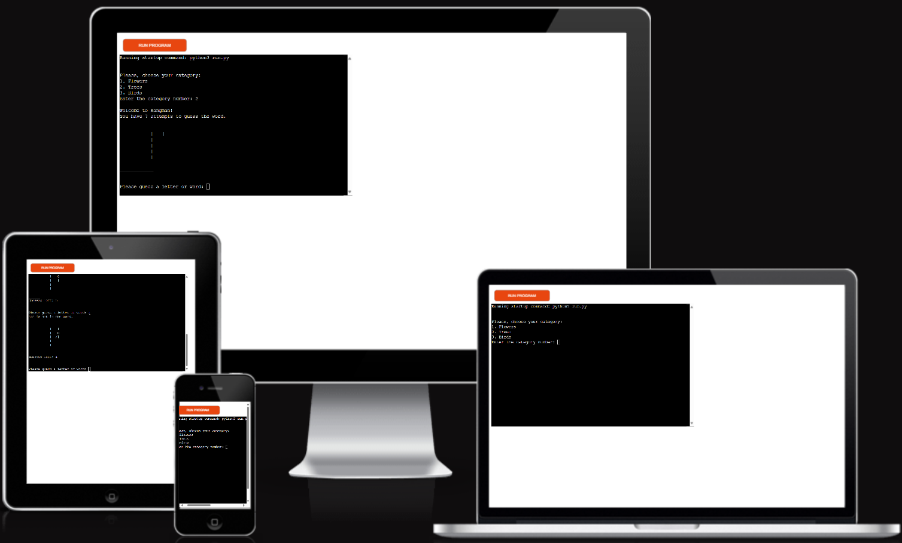
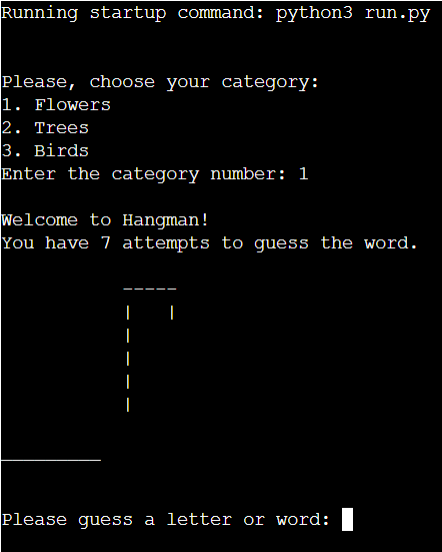
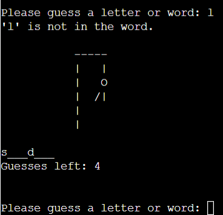
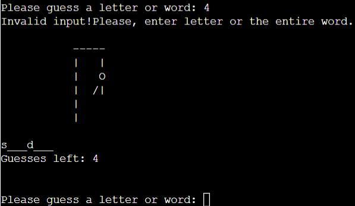
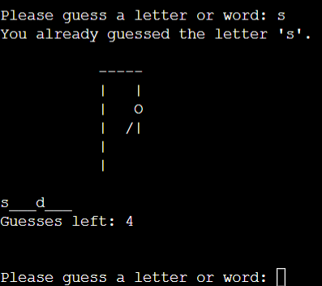
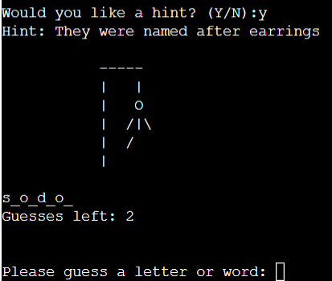
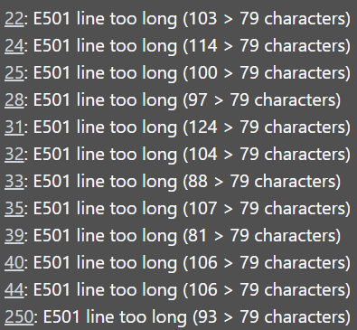

# The Hangman
The Hangman is a Python terminal game, which runs in the Code Institute mock terminal on Heroku.   Players compete against the computer to guess the correct word chosen by the computer. Players can choose from three categories: Flowers, Trees, and Birds. During the game, the computer provides hints if needed. The game ends when the word is guessed or the player runs out of guesses.    Please see the live version of [Hangman](https://hangman12-8daeb7aeaeed.herokuapp.com/)   

## How to play
The word to guess is represented by a row of dashes representing each letter of the word. If the player suggests a letter which occurs in the word, the computer types it in all its correct positions. If the suggested letter does not occur in the word, computer adds one element of a hanged stick figure as a tally mark. Generally, the game ends once the word is guessed, or if the stick figure is complete — signifying that all guesses have been used.

## Features
Existing Features
<ul><li>Choose the category</li> 
<li>Enter the number of chosen category</li> 
 
<li>Appears the gallows</li>
<li>Enter the letter (if the letter is in the word it will appear in correct position)</li>
<li>Update the count of guesses and if the letter was not guessed add one element to the gallows</li> 
 
<li>Input validation and error-checking</li>
<ul><li>Invalid input!Please enter letter or entire word 
 
<li>You allready guessed the letter</li> 
 
<li>Would you like a hint?</li> 
</ul></ul> 

## Data Model
The data model consists primarily of dictionaries (divisions and hints), lists (guessed_letters, guessed_words), strings (word, word_completion), and integers (tries, max_tries, score, hints_used). 
The game state is dynamic and updates based on the player's interactions and guesses.
The functions manage user inputs, update game data, and control game flow. 

## Testing
I have tested this project in PEP8 - i can confirm, no issues  
Entered invalid data, numbers instead of letters, input twice the same letter  
Tested in my own computers`s terminal and the Code Institute terminal  

### Bugs
When I was writting the code my stick figure were showing reversed way. I fixed it changing code: return stages[tries] to return stages[max_tries - tries - 1].

### Remaining Bugs
None

### Validator Testing
It had indicated code lines to be long for my hint section. When I changed them my terminal did not allow me to run the code and showed syntax error and I could not run the code.  
  I fixed it by breaking lines with backslash ' \ '   

## Deployment
This project was deployed using Code Institute`s mock terminal for Heroku.
<li>Cloned Code Institute`s repository</li>
<li>In Heroku created a new app</li>
<li>Add the buildbacks to Python and NodeJS as per instructions provided</li>
<li>Link Heroku app to GitHub repository and deployed</li>

## Credits
Google and Wikipedia for Hangman description 
Code Institute for tamplate and README.md example and Love Sandwiches project example 
Udemy 
Hanged stick figure code copied from Google